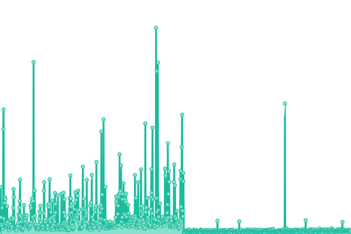
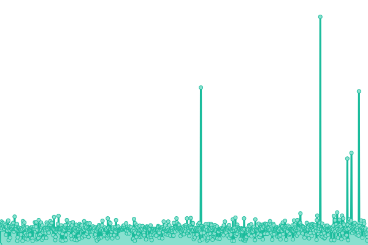

# [📈 Live Status](https://hwittenborn.github.io/status): <!--live status--> **🟩 All systems operational**

This repository contains the open-source uptime monitor and status page for [Hunter Wittenborn](https://hunterwittenborn.com), powered by [Upptime](https://github.com/upptime/upptime).

With [Upptime](https://upptime.js.org), you can get your own unlimited and free uptime monitor and status page, powered entirely by a GitHub repository. We use [Issues](https://github.com/hwittenborn/status/issues) as incident reports, [Actions](https://github.com/hwittenborn/status/actions) as uptime monitors, and [Pages](https://hwittenborn.github.io/status) for the status page.

<!--start: status pages-->
<!-- This summary is generated by Upptime (https://github.com/upptime/upptime) -->
<!-- Do not edit this manually, your changes will be overwritten -->
<!-- prettier-ignore -->
| URL | Status | History | Response Time | Uptime |
| --- | ------ | ------- | ------------- | ------ |
|  [Homepage](https://hunterwittenborn.com) | 🟩 Up | [homepage.yml](https://github.com/hwittenborn/status/commits/HEAD/history/homepage.yml) | 

 99ms
     
 | 

<a href="https://hwittenborn.github.io/status/history/homepage">100.00%</a>
    

|  [Matrix](https://matrix.hunterwittenborn.com) | 🟩 Up | [matrix.yml](https://github.com/hwittenborn/status/commits/HEAD/history/matrix.yml) | 

 579ms
     
 | 

<a href="https://hwittenborn.github.io/status/history/matrix">96.54%</a>
    

|  [Shlink](https://shlink.makedeb.org/install) | 🟩 Up | [shlink.yml](https://github.com/hwittenborn/status/commits/HEAD/history/shlink.yml) | 

 630ms
     
 | 

<a href="https://hwittenborn.github.io/status/history/shlink">98.74%</a>
    

|  [makedeb Homepage](https://www.makedeb.org) | 🟩 Up | [makedeb-homepage.yml](https://github.com/hwittenborn/status/commits/HEAD/history/makedeb-homepage.yml) | 

 146ms
     
 | 

<a href="https://hwittenborn.github.io/status/history/makedeb-homepage">100.00%</a>
    

|  [makedeb Docs](https://docs.makedeb.org) | 🟩 Up | [makedeb-docs.yml](https://github.com/hwittenborn/status/commits/HEAD/history/makedeb-docs.yml) | 

 141ms
     
 | 

<a href="https://hwittenborn.github.io/status/history/makedeb-docs">100.00%</a>
    

|  [makedeb Package Repository](https://mpr.makedeb.org) | 🟩 Up | [makedeb-package-repository.yml](https://github.com/hwittenborn/status/commits/HEAD/history/makedeb-package-repository.yml) | 

 374ms
     
 | 

<a href="https://hwittenborn.github.io/status/history/makedeb-package-repository">99.94%</a>
    

|  [makedeb Package Repository (SSH)](mpr.makedeb.org) | 🟩 Up | [makedeb-package-repository-ssh.yml](https://github.com/hwittenborn/status/commits/HEAD/history/makedeb-package-repository-ssh.yml) | 

 43ms
     
 | 

<a href="https://hwittenborn.github.io/status/history/makedeb-package-repository-ssh">100.00%</a>
    

|  [makedeb ProGet Instance](https://proget.makedeb.org) | 🟩 Up | [makedeb-pro-get-instance.yml](https://github.com/hwittenborn/status/commits/HEAD/history/makedeb-pro-get-instance.yml) | 

 366ms
     
 | 

<a href="https://hwittenborn.github.io/status/history/makedeb-pro-get-instance">100.00%</a>
    

|  [RhinoDrop](https://drop.rhinolinux.org) | 🟩 Up | [rhino-drop.yml](https://github.com/hwittenborn/status/commits/HEAD/history/rhino-drop.yml) | 

 352ms
     
 | 

<a href="https://hwittenborn.github.io/status/history/rhino-drop">100.00%</a>
    

<!--end: status pages-->

[**Visit our status website →**](https://hwittenborn.github.io/status)

## 📄 License

- Powered by: [Upptime](https://github.com/upptime/upptime)
- Code: [MIT](./LICENSE) © [Hunter Wittenborn](https://hunterwittenborn.com)
- Data in the `./history` directory: [Open Database License](https://opendatacommons.org/licenses/odbl/1-0/)
